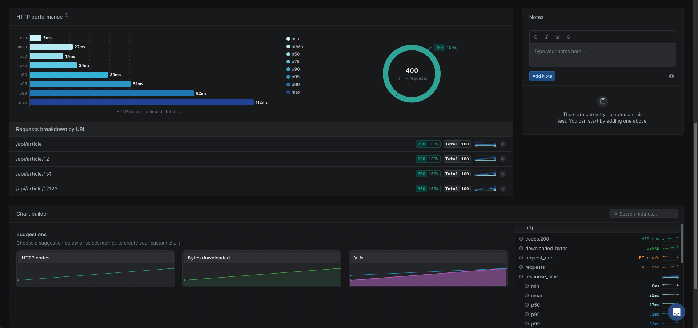

# 테이블 데이터 삽입 기록
1. 로우가 500만개 있는 aricle_agree에서 FK를 제거했다가 다시 추가하는 작업을 진행하였음.
해당 과정에서 FK를 추가하는데 10m 37s가 소요되는 것을 확인

2. 최근 게시글 조회 페이징 조회 : 풀스캔시 11.41s
인덱스 사용후, 0.03s로 개선
3. 게시글 상세조회 : 62ms

## 게시글 조회 평균 응답값
- 10초간 400req  
게시글 페이징 조회(100req) : p95: 24ms ~ 29ms  
게시글 상세 조회(300req) : p95: 40ms ~ 73ms

