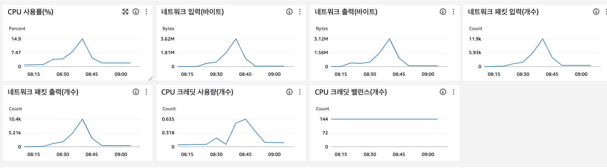

# AWS 프리티어 환경으로 이전
- EC2 : CPU 1, 메모리 1GB, 스토리지 30GB
- RDS : CPU 2, 메모리 1GB, 20GB 스토리지
- ELASTIC CACHE : 메모리 0.555GB

# 기록
- 2024/06/28 : AWS 프리티어 환경으로 이전, 데이터 약 800만건 적재 완료
- 2024/07/01 : 인덱스 생성  
`CREATE INDEX idx_created_at_article_status_views_count ON article (created_at DESC, article_status, views_count DESC);`
 소요시간 20.55s

API GET /articles, /articles/12, /articles/151, /articles/12123
- 초당 40건 호출시 p50 78ms, p95 147ms, p99 194ms
- 초당 80건 호출시 p50 50ms, p95 70ms p99 79ms
- 초당 120건 호출시 p50 113ms, p95 327ms, p99 391ms 
- 초당 160건 호출시 p50 347ms, p95 4316ms, p99 4492ms
- 초당 200건 호출시 p50 3262ms, p95 5272ms, p99 5487ms 

2회차 측정
- 초당 200건 호출시 p50 187ms, p95 659ms, p99 789ms
- 초당 160건 호출시 p50 38ms, p95 55ms, p99 65ms
- 초당 120건 호출시 p50 25ms, p95 37ms, p99 42ms 
- 
- 초당 160건 호출시 p50 472ms, p95 925ms, p99 982ms
- 

# 시도1 : 톰켓 쓰레드 200->400개로 늘리기
API GET /articles, /articles/12, /articles/151, /articles/12123
- 초당 40건 호출시 p50 252ms, p95 320ms, p99 376ms
- 초당 80건 호출시 p50 249ms, p95 333ms, p99 347ms
- 초당 120건 호출시 p50 852ms, p95 1720ms, p99 1939ms
- 초당 160건 호출시 p50 1565ms, p95 3072ms, p99 3395ms
- 초당 200건 호출시 p50 3905ms, p95 5826ms, p99 6187ms

2회차 측정
- 초당 200건 호출시 p50 2276ms, p95 4147ms, p99 4583ms
- 초당 160건 호출시 p50 727ms, p95 1495ms, p99 1720ms
- 초당 120건 호출시 p50 159ms, p95 202ms, p99 214ms
- 초당 80건 호출시 p50 127ms, p95 172ms, p99 320ms

-> CPU 1개인 EC2에서 톰켓 쓰레드를 400개로 늘렸지만 성능이 더 떨어짐, 
메모리 사용량은 40%로 안정적

# 시도2: hikariCP mysql 추천 설정 적용
API GET /articles, /articles/12, /articles/151, /articles/12123
- 초당 40건 호출시 p50 224ms, p95 219ms, p99 347ms
- 초당 80건 호출시 p50 172ms, p95 232ms, p99 252ms
- 초당 120건 호출시 p50 889ms, p95 1224ms, p99 1326ms
- 초당 160건 호출시 p50 1274ms, p95 2515ms, p99 2951ms
- 초당 200건 호출시 p50 3134ms, p95 5272ms, p99 5711ms

2회차 측정
- 초당 200번 호출시 p50 1107ms, p95 2836ms, p99 3395ms
- 초당 160건 호출시 p50 247ms, p87 262ms, p99 424ms
- 초당 120건 호출시 p50 133ms, p95 172ms, p99 223ms
- 초당 80건 호출시 p50 108ms, p95 108ms, p99 147ms